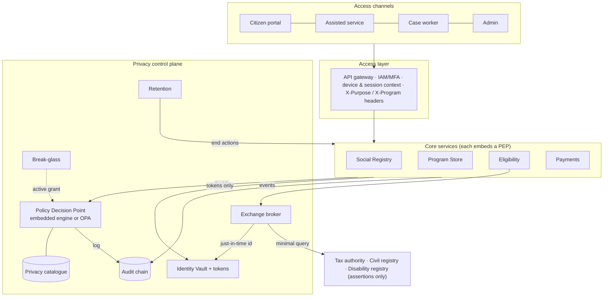

# PbD-SPMIS: a Privacy-by-Design control plane for Social Protection MIS

**An open, executable reference implementation of privacy-by-design for government beneficiary
systems.** Purpose-bound authorisation, attribute-level selective disclosure, tokenised identity,
"query, do not copy" inter-agency exchange, break-glass as a workflow, tamper-evident audit and
catalogue-driven retention. Every rule is testable; both a Python reference engine and an Open
Policy Agent policy pass the same conformance suite.

It implements the *Privacy-by-Design Architecture for Social Protection MIS: Architecture and
Implementation Guide* ([docs/reference](docs/reference/privacy-by-design-spmis-guide.md)) as
running software, so that a ministry, an integrator or a digital-public-goods project can start
from working controls instead of a diagram.

```
$ pip install -e ".[dev]" && pbd-spmis demo

== 3. What the case worker sees in the registry under eligibility_verification
   -> income became a threshold assertion, address a district, obligations attached
{
  "attributes": {"income": true, "address": {"district": "North"}, "household_size": 4, "disability_status": false},
  "release":    {"income": "assertion:below_threshold", "address": "precision:district", ...},
  "obligations": "expire_response:24h,log,no_export"
}
   -> the same worker on a low-trust device: sensitive attributes are withheld
{"household_size": 4}
```

## Why this exists

Social protection systems hold the most sensitive data a state collects about its poorest
citizens, and they are usually built as one over-rich beneficiary profile with role-based
access bolted on. Privacy frameworks (NIST Privacy Framework, ISO 31700) describe what good
looks like; almost nothing ships as code. This repository closes that gap with:

| What | Where | Why it matters |
| --- | --- | --- |
| **Machine-readable privacy catalogue**: purposes with lawful bases, attribute classification (C1 to C4), per-purpose release modes, role overrides, programs, retention schedule, inter-agency sharing matrix | [`catalog/`](catalog) + JSON Schema | Privacy administrators change what a role may see without touching application code. Validated for cross-references on every load. |
| **Policy Decision Point** with two interchangeable engines: an embedded Python reference evaluator and a Rego policy for OPA | [`src/pbd_spmis/pdp`](src/pbd_spmis/pdp), [`policy/rego`](policy/rego) | Decisions are per attribute (`exact`, `band`, `assertion:below_threshold`, `precision:district`, `token`, `masked`, `verify_only`, `deny`) with obligations and stable reason codes. |
| **Conformance suite**: 31 vectors derived from the guide's privacy tests, replayed against both engines and through the HTTP contract | [`policy/conformance`](policy/conformance) | The guide's section 14.1 tests (purpose enforcement, minimisation, cross-program isolation, token unlinkability, export control, break-glass) are executable acceptance criteria any implementation can be held to. |
| **Policy Enforcement Point library** that applies the release transformations next to the data and attaches obligations as response headers | [`common/pep.py`](src/pbd_spmis/common/pep.py) | The service holding a salary is the only place that can turn it into "below threshold: true". |
| **Identity Vault + tokenization** with envelope encryption, blind-index deduplication, program-specific identifiers and policy-gated resolution | [`vault`](src/pbd_spmis/vault) | Direct identifiers exist in exactly one store. Every other store is keyed by opaque tokens; a leaked program database cannot be joined to anything. |
| **Data exchange broker** ("query, do not copy") with a sharing matrix, response schema filtering, just-in-time identifier resolution and TTL-bound assertion cache | [`broker`](src/pbd_spmis/broker) | The tax authority answers "income below threshold?", not "what is the income?". The national id is held in memory for one call and never written. |
| **Break-glass manager**: MFA, separation of duties, time-bound grants scoped to one subject and named attributes, alerts, mandatory review | [`breakglass`](src/pbd_spmis/breakglass) | Exceptional access is a workflow with evidence, not an administrator back door. |
| **Audit store** that is append-only, hash-chained, PII-guarded, logs its own reads and serves the privacy-operations dashboard | [`audit`](src/pbd_spmis/audit) | Tampering is detectable; the log records *that* data was released, never *what*. |
| **Retention engine** driven by the catalogue, executing archive / anonymise / delete through each owning service | [`retention`](src/pbd_spmis/retention) | Retention attaches to data class and purpose; expiry produces evidence. |
| **Reference SP-MIS services** on top: Social Registry, Program Store (enrollment, entitlement, cases), Eligibility (Appendix B contract), Payments (tokenised instruments, provider adapter, reconciliation) | [`src/pbd_spmis`](src/pbd_spmis) | Proves the control plane carries a real delivery chain end to end. |
| **Generated OpenAPI contracts** for all ten services, with the privacy headers documented | [`contracts/openapi`](contracts/openapi) | Vendors can interoperate against the contract without adopting the code. |
| One image, one command: all-in-one, Docker Compose with PostgreSQL + OPA, or one container per service | [`docker-compose.yml`](docker-compose.yml) | Same code in every mode; in-process dispatch in dev, HTTP in production. |
| **Client SDK** for the control plane API v1 with the release transformations built in | [`src/pbd_spmis/sdk`](src/pbd_spmis/sdk) | Any MIS, adapter or gateway embeds privacy decisions with one `httpx`-only dependency. |
| **openIMIS / CORE-MIS adapter**: `openimis-be-pbd` backend module (graphene middleware, optional identifier vaulting) plus a deployment mapping | [`integrations/openimis`](integrations/openimis) | The most widely deployed open-source SP-MIS gains purpose-bound minimisation, read auditing and fail-closed behaviour by adding one module and one header. |
| **Privacy gateway** for GraphQL and FHIR/REST APIs of systems that cannot embed the module | [`src/pbd_spmis/gateway`](src/pbd_spmis/gateway) | Legacy CORE-MIS and third-party systems get the same decisions at the edge. |

## Architecture in one picture



The control plane is a cross-cutting layer, not a module. Every sensitive request carries an
actor, program, purpose and context; every response carries a decision id, the policy version
and the obligations the caller must honour.

## Quick start

```bash
git clone https://github.com/nahmedpsu/PbD-for-SPMIS && cd PbD-for-SPMIS
python -m venv .venv && . .venv/bin/activate
pip install -e ".[dev]"

pbd-spmis demo                  # the end-to-end privacy walkthrough, in-process, fresh databases
pbd-spmis serve all             # http://localhost:8000  (each service at /<service>/docs)
pbd-spmis catalog validate      # validate catalog/*.yaml
python -m pytest                # 150+ tests incl. 31 conformance vectors x (python, rego, http)
```

With Docker (PostgreSQL, one database per service, PDP delegating to OPA):

```bash
docker compose up --build       # then open http://localhost:8000/
docker compose --profile distributed up   # one container per service
```

Talk to it:

```bash
TOKEN=$(pbd-spmis token --sub cw-1 --role CASE_WORKER --programs cash_assistance)
curl -s http://localhost:8000/registry/v1/persons/P-XXXXXXXX?attributes=income,address \
  -H "Authorization: Bearer $TOKEN" -H "X-Purpose: eligibility_verification" -H "X-Program: cash_assistance"
```

See [`examples/walkthrough.sh`](examples/walkthrough.sh) for the whole chain over HTTP.

## Bringing privacy-by-design to openIMIS and CORE-MIS

openIMIS (into which the World Bank's CORE-MIS was merged in 2023) is the most widely deployed
open-source social protection MIS. This repository adds privacy-by-design to it without a fork:

```json
// openimis.json of the backend assembly
{ "name": "pbd", "pip": "openimis-be-pbd==0.1.0" }
```

```python
GRAPHENE = {"MIDDLEWARE": ["pbd.middleware.PrivacyMiddleware", ...]}
```

With the module installed, `query { individual { firstName dob jsonExt } }` sent with
`X-Purpose: eligibility_verification` by a case worker returns `firstName: null`,
`dob: "1990"` and `jsonExt: {"income": true, "national_id": {"verified": true}, ...}`; the
same query under `registration` by a registration officer returns the full record, and under
`analytics_reporting` it is refused with `ROLE_NOT_PERMITTED`. Every read is audited, the
control plane being down fails closed, and with `vault_identifiers: true` national identifiers
never reach the openIMIS database. Systems that cannot embed the module (legacy Java CORE-MIS,
vendor APIs) run behind `pbd-spmis gateway`. Details, mapping and limits:
[docs/integrations/openimis.md](docs/integrations/openimis.md).

## The decision model in thirty seconds

A policy input names the actor, the subject, the program, the purpose, the action and the
attributes. The engine runs a fixed sequence of **gates** (authentication, purpose exists,
purpose registered for program, role permitted, action permitted, program assignment, subject
relationship, case assignment, MFA, break-glass grant); the first failure denies with a stable
reason code. If the gates pass, each attribute gets a **release mode** from the purpose's
release map (with role overrides), downgraded by context (a low-trust device never receives C4
data). Reads are allowed only if something is releasable. **Obligations** (`log`, `no_export`,
`expire_response:24h`, `alert`, `review_required`, `k_anonymity:5`...) travel with the decision.

```json
{"allow": true, "policy_version": "2026.10.0",
 "release": {"income": "assertion:below_threshold", "household_size": "exact",
             "disability_status": "assertion:eligible", "bank_account": "deny", "address": "precision:district"},
 "obligations": ["expire_response:24h", "log", "no_export"], "reason_codes": ["ALLOW"]}
```

Full description: [docs/decision-model.md](docs/decision-model.md).

## Repository layout

```
catalog/            purposes.yaml attributes.yaml programs.yaml policy.yaml retention.yaml sharing.yaml + JSON Schema
policy/rego/        OPA policy (spmis/authz.rego) and its tests
policy/conformance/ vectors.json: the executable privacy acceptance tests
policy/bundle/      generated OPA data bundle (catalogue + vectors)
contracts/openapi/  generated OpenAPI 3.1 contracts, one per service
src/pbd_spmis/      common/ (auth, context, crypto, db, clients, pep, audit client) + one package per service
src/pbd_spmis/sdk/  client SDK for the control plane API v1 (decisions, vault, broker, audit, break-glass, transforms, mapping)
src/pbd_spmis/gateway/  privacy gateway (GraphQL + FHIR/REST response minimisation at the edge)
integrations/       openimis/ (mapping.yaml + openimis-be-pbd_py module), gateway/ (example configuration)
tests/              conformance, catalogue, primitives, end-to-end flows, break-glass/audit/retention, resilience
docs/               architecture, decision model, conformance, deployment, threat model, guide mapping, ADRs, reference guide
deploy/             PostgreSQL init (one database per store)
examples/           HTTP walkthrough
```

## What the tests prove

| Guide test (14.1) | Test |
| --- | --- |
| Purpose enforcement: same actor, same field, allowed vs disallowed purpose | `test_purpose_enforcement_*`, vectors `purpose_enforcement_*` |
| Minimisation: ask for income, receive a threshold assertion | `test_minimisation_case_worker_sees_assertions_not_values`, `appendix_a_*` |
| Cross-program isolation | `test_cross_program_isolation`, vector `cross_program_isolation` |
| Token unlinkability: program services cannot resolve a token to a national id | `test_token_unlinkability`, vector `token_unlinkability_for_program_services` |
| Export controls: bulk export denied or elevated and audited; k-anonymity | `test_export_is_deidentified_and_k_anonymous`, vectors `analyst_export_*`, `export_denied_*` |
| Retention: expired records archived / anonymised / deleted with evidence | `test_retention_engine_executes_end_actions` |
| Break-glass: expiry, alert, review, separation of duties | `test_break_glass_lifecycle`, `test_break_glass_expires`, six vectors |
| Audit integrity: tampering detected, audit access logged | `test_audit_chain_detects_tampering_and_logs_reads` |
| Fail-closed when the policy engine or audit store is unavailable | `test_sensitive_reads_fail_closed_*`, `test_disclosure_fails_closed_*` |
| No non-vault database ever contains a national id or name | `test_eligibility_queries_do_not_copy_and_store_provenance`, `test_identity_proofing_*` |

## Status and roadmap

This is version 0.1: a complete, tested reference implementation intended for evaluation,
adaptation and procurement language, not a drop-in production system. Production hardening is
documented in [docs/deployment.md](docs/deployment.md) (OIDC/JWKS, KMS/HSM key provider,
PostgreSQL roles per store, OPA bundle distribution, mTLS). Planned next:

- Validation of `openimis-be-pbd` inside the official openIMIS Docker distribution, and a
  relationship resolver reading `Beneficiary` rows for exact cross-program isolation.
- A one-off migration job that vaults identifiers already stored in `individual.json_ext`.
- Grievance service and citizen portal flows (notice versioning, data-subject requests).
- Offline/assisted-channel packages with scoped, short-lived tokens.
- Pluggable adapters for real registries (signed requests, mTLS) and a payment provider SDK.
- Kubernetes manifests for the seven security zones.
- Statistical disclosure control beyond k-anonymity for the analytics store.
- A second policy engine conformance target (e.g. Cedar) to prove the vectors are engine-neutral.

Contributions are welcome; see [CONTRIBUTING.md](CONTRIBUTING.md). Security reports: [SECURITY.md](SECURITY.md).

## License

Apache License 2.0. The reference guide in `docs/reference` is included with the permission of
its author for the purpose of documenting this implementation.
