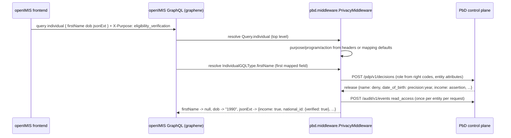

# Integrating with openIMIS and CORE-MIS

## Background

openIMIS is the open-source, Digital Public Good platform for health financing and social
protection schemes (Django backend assembled from pip modules, GraphQL API, React frontend,
AGPL-3.0). The World Bank's CORE-MIS, originally a separate Java/Spring Boot/MongoDB platform
built during the COVID-19 response, was merged into openIMIS in 2023 and is now delivered as
"CORE-MIS powered by openIMIS". Integrating with openIMIS therefore covers both, with the
privacy gateway available for any remaining legacy Java deployments.

openIMIS authorises with roles made of numeric right codes and scopes users geographically. It
has no notion of purpose, no attribute-level minimisation, no separation of identifiers from
program data, and its mutation log records writes but not reads. Its own documentation lists
"mark personal data", "audit log of access to personal data" and consent as open requirements.

## What this repository provides

| Piece | Path | Role |
| --- | --- | --- |
| Client SDK | `src/pbd_spmis/sdk` | Dependency-light client for the control plane API v1 (decisions, catalogue view, vault, broker, audit, break-glass) with the release transformations |
| Mapping | `integrations/openimis/mapping.yaml` | openIMIS types/fields to catalogue attributes, right codes to PbD roles, operations to default purposes, benefit plans to programs, vaulting rules |
| Backend module | `integrations/openimis/openimis-be-pbd_py` | `openimis-be-pbd`: graphene middleware + optional vaulting + service-signal auditing, installable through `openimis.json` |
| Gateway | `src/pbd_spmis/gateway`, `integrations/gateway/gateway.example.yaml` | Reverse proxy enforcing the same decisions on GraphQL and FHIR responses for systems that cannot embed the module |

## How a request flows with the module

One decision per entity type and subject relationship per request, cached on the request, so a
list of 500 individuals costs one control-plane round trip, not 500.

## Mapping openIMIS concepts

| openIMIS | PbD-SPMIS | Notes |
| --- | --- | --- |
| `BenefitPlan.code` | program | `programs.by_benefit_plan_code` in the mapping |
| `Beneficiary` (individual × benefit plan) | program relationship | with `relationship_mode: resolver`, read from `Beneficiary` rows; `assume` otherwise |
| `Group` | household | `Group` entity in the mapping |
| `Individual.first_name/last_name` | `name` | class C3 |
| `Individual.dob` | `date_of_birth` | C3; released as year under eligibility and analytics purposes |
| `Individual.json_ext.national_id` | `national_id` | C4; verify-only or denied except for identity proofing; vaulted when enabled |
| `Individual.json_ext.*` (schema-defined) | catalogue attributes | map each deployment's JSON-schema fields; unmapped keys pass through unchanged |
| Role rights (e.g. 170001 search beneficiary) | PbD role | ordered rules in `roles:`; first match wins |
| GraphQL operation | default purpose and action | `operations:`; `X-Purpose` overrides |
| `InteractiveUser` / `TechnicalUser` | human / service actor | technical users are treated as service identities |

## Three deployment patterns

1. **Module only** (recommended for openIMIS 2023+): install `openimis-be-pbd`, point it at
   the control plane, map the deployment's JSON-schema fields and right codes, have the frontend
   send `X-Purpose`. Minimisation, auditing and fail-closed behaviour apply inside the backend,
   including to the FHIR module's resolvers that go through graphene.
2. **Module + vaulting**: additionally enable `vault_identifiers` so new individuals' national
   identifiers live only in the Identity Vault. Migration of existing rows is a one-off job:
   tokenize each identifier through the vault and replace it with the placeholder and token.
3. **Gateway**: for legacy Java CORE-MIS, other MIS products or vendor APIs, run
   `pbd-spmis gateway --config gateway.yaml` in front of the API. Actor identity comes from an
   identity-aware proxy's headers or from the client's JWT claims.

## Purpose headers for the frontend

openIMIS frontend modules know which business function a screen serves. Until each module sends
`X-Purpose` itself, the mapping's per-operation defaults keep existing clients working:
`individual` queries default to `registration`, `beneficiary` to `enrollment`, exports to
`analytics_reporting`. Turning on `require_purpose_header` makes the explicit header mandatory
once clients are migrated.

## What is verified

`tests/test_openimis_module.py` runs the middleware against a graphene schema shaped like
openIMIS's `IndividualGQLType` / `BeneficiaryGQLType` (including `jsonExt` as a generic scalar
and a `createIndividual` mutation) and the real in-process control plane: minimised views per
purpose, operation default purposes, role derivation from right codes, pass-through of unmapped
operations, low-trust downgrades on nested individuals, one audit event per entity, identifier
vaulting, and fail-closed behaviour. `tests/test_gateway.py` does the same for the gateway with
a fake upstream serving GraphQL connections and a FHIR Patient.

**Verified inside real openIMIS.** `integrations/openimis/validation/run_validation.py` boots
the genuine `openimis-be_py` assembly with the published modules (core 1.11.0, individual 1.4.0,
social_protection 1.5.0, calculation, workflow, tasks_management, location and their migration
dependencies) on PostgreSQL 16 with openIMIS's database scripts, seeds roles with the reference
right codes, and issues GraphQL requests through openIMIS's own view with openIMIS-issued JWTs.
Result: 18 of 18 checks pass (Django 4.2.30, graphene 2.1.9). The run surfaced four
openIMIS-specific behaviours that are now built into the module and its unit tests: non-nullable
personal fields receive a redaction marker instead of null, `Date` fields receive date values at
the released precision, graphene 2 promises are chained, and the middleware must be last in the
chain because of openIMIS's tracer. The recipe and the detailed findings are in
[`integrations/openimis/validation/README.md`](../../integrations/openimis/validation/README.md).
