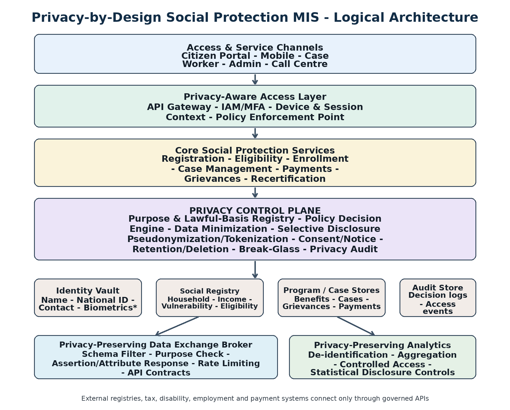
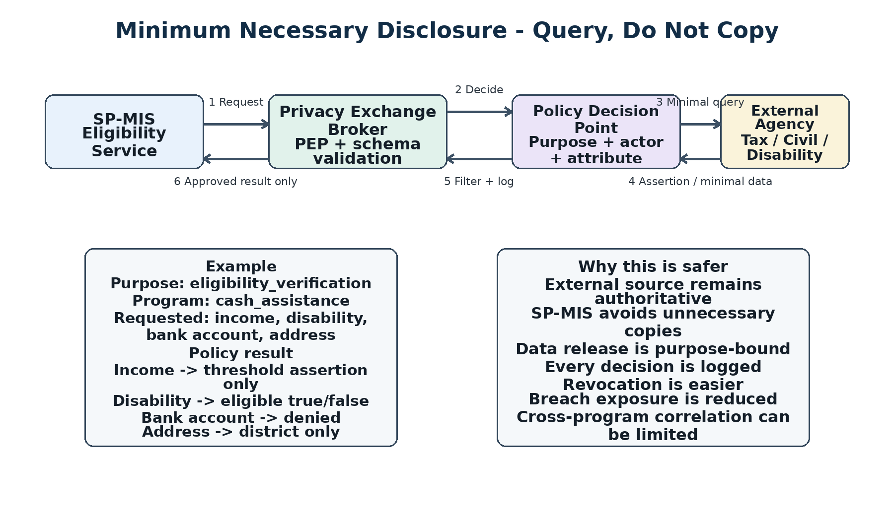

> **Source document.** This is the architecture and implementation guide that this repository implements, converted from the original Word document for convenience. The code, catalogue and tests in this repository are the executable form of it; see [guide-mapping.md](../guide-mapping.md) for the section-by-section trace.

**PRIVACY-BY-DESIGN\
ARCHITECTURE FOR\
SOCIAL PROTECTION MIS**

*Architecture and Implementation Guide*

**Purpose-bound \| Data-minimizing \| Interoperable \| Auditable \|
Secure by default**

Implementation-oriented reference design for beneficiary registries,
eligibility, case management, payments, grievances, and controlled
inter-agency data exchange.

# Document Structure

1\. Purpose, Scope and Design Goals

2\. Privacy-by-Design Principles

3\. Logical Architecture

4\. Component Architecture

5\. Privacy-Aware Data Architecture

6\. Core Operational Workflows

7\. Policy Enforcement Model

8\. API and Interoperability Design

9\. Implementation Methodology

10\. Recommended Technology Capabilities

11\. Deployment Architecture

12\. Security and Privacy Control Baseline

13\. Non-Functional Requirements

14\. Testing and Assurance

15\. Migration from an Existing MIS

16\. Operations and Governance

17\. Phased Rollout Plan

18\. Implementation Deliverables and Acceptance Criteria

Appendices

References

**Document intent -** This guide is implementation-focused. It describes
how to build and operate a Social Protection MIS in which privacy
controls are enforced by the software architecture, data model and
operational processes.

# 1. Purpose, Scope and Design Goals

The proposed Social Protection Management Information System (SP-MIS)
supports the full social-protection delivery chain while embedding
privacy controls directly into software and data architecture. It
enables agencies to determine eligibility, deliver benefits, manage
cases, resolve grievances and perform monitoring without granting
unrestricted access to a single, overly rich beneficiary profile.

## 1.1 In scope

-   Citizen and household registration

-   Identity verification and deduplication

-   Socioeconomic assessment and eligibility determination

-   Program enrollment and recertification

-   Case management and grievance redress

-   Benefit and payment orchestration

-   Controlled inter-agency verification

-   Document management

-   Operational reporting and analytics

-   Privacy requests, retention, deletion and audit

## 1.2 Design goals

  -----------------------------------------------------------------------
  **Goal**                            **Implementation interpretation**
  ----------------------------------- -----------------------------------
  Minimum necessary disclosure        Release only the exact attribute,
                                      derived assertion or level of
                                      precision required for an approved
                                      purpose.

  Purpose-bound access                Every sensitive data request
                                      carries actor, program, purpose,
                                      lawful basis and requested
                                      attributes.

  Identity/data separation            Direct identifiers are isolated
                                      from socioeconomic and case data
                                      using controlled token linkage.

  Interoperability without            Prefer verified queries and
  uncontrolled replication            assertions from authoritative
                                      systems over bulk copying.

  Auditable decisions                 Record policy decisions, data
                                      releases, exceptional access and
                                      administrative changes in protected
                                      logs.

  Security by default                 Strong authentication, encryption,
                                      least privilege, segmentation,
                                      secrets management and secure SDLC
                                      are baseline requirements.

  Operational resilience              Design for low-connectivity
                                      channels, high availability,
                                      backup, disaster recovery and
                                      graceful degradation.
  -----------------------------------------------------------------------

# 2. Privacy-by-Design Principles

  -----------------------------------------------------------------------
  **Principle**                       **Architecture consequence**
  ----------------------------------- -----------------------------------
  Purpose limitation                  A data item is processed only for
                                      explicitly registered and approved
                                      service purposes.

  Data minimization                   Forms, APIs, databases and reports
                                      collect or expose only fields
                                      needed for the workflow.

  Selective disclosure                Return a yes/no assertion,
                                      category, threshold result or
                                      coarse location instead of raw
                                      source data where possible.

  Disassociability                    Use program-specific identifiers
                                      and pseudonymous linkage to reduce
                                      casual cross-program correlation.

  Predictability and transparency     Actual processing behavior, notices
                                      and access rules should be
                                      documented and consistent.

  Manageability                       Privacy administrators can change
                                      purposes, retention, notices and
                                      sharing rules without rewriting
                                      applications.

  Retention discipline                Retention attaches to data class
                                      and purpose; expiry triggers
                                      review, archive, anonymization or
                                      deletion.

  Accountability                      Every privileged access and
                                      override is attributable and
                                      reviewable.
  -----------------------------------------------------------------------

**Implementation rule -** Do not treat consent as the universal lawful
basis for social protection. Support consent when appropriate, but also
model statutory authority, public-service mandate and other
jurisdiction-specific legal bases.

# 3. Logical Architecture

*Figure 1. Privacy is a cross-cutting control plane between business
services and data, not a single add-on module.*

  -----------------------------------------------------------------------
  **Layer**                           **Primary responsibilities**
  ----------------------------------- -----------------------------------
  Access and channels                 Web, mobile and assisted-service
                                      channels; safe session handling;
                                      localization and accessibility.

  Access control and API layer        Authentication, MFA, rate limiting,
                                      request context, schema validation
                                      and policy enforcement.

  Core domain services                Registration, eligibility,
                                      enrollment, case, grievance,
                                      payments and recertification.

  Privacy control plane               Purpose registry, policy decisions,
                                      minimization, tokenization,
                                      retention, sharing rules,
                                      break-glass and audit.

  Data layer                          Identity vault, social registry,
                                      program/case stores, documents and
                                      protected audit store.

  Integration layer                   Government data exchange, payment
                                      integrations, messaging and
                                      controlled external APIs.

  Analytics layer                     De-identified operational
                                      analytics, approved extracts and
                                      controlled BI access.
  -----------------------------------------------------------------------

# 4. Component Architecture

## 4.1 Access channels

All channels call governed APIs rather than databases directly. Each
request is associated with the authenticated actor, organization,
program, device/session context and business purpose.

-   Citizen portal/mobile app for registration, updates, notices, status
    and grievances.

-   Assisted-service interface for field workers/service centers with
    restricted views and optional offline synchronization.

-   Case-worker interface with task-based access rather than broad
    record browsing.

-   Administrative portal separated from operational functions and
    protected with stronger authentication and approvals.

## 4.2 Identity and access management

  -----------------------------------------------------------------------
  **Capability**                      **Recommended behavior**
  ----------------------------------- -----------------------------------
  Identity federation                 Integrate with a government
                                      identity provider where available;
                                      avoid separate passwords for each
                                      subsystem.

  MFA                                 Require stronger authentication for
                                      privileged users and high-risk
                                      operations.

  RBAC + ABAC/PBAC                    Use roles for coarse access and
                                      attributes/purpose for fine-grained
                                      decisions.

  Service identities                  Each service-to-service call uses a
                                      distinct machine identity; do not
                                      share technical accounts.

  Session risk                        Capture device/session risk and
                                      re-authenticate for sensitive
                                      actions.

  Privileged access                   Use time-bounded privileges where
                                      feasible and review administrator
                                      activity.
  -----------------------------------------------------------------------

## 4.3 Privacy control plane

  -----------------------------------------------------------------------
  **Component**                       **Function**
  ----------------------------------- -----------------------------------
  Purpose and lawful-basis registry   Catalog approved purposes, legal
                                      basis, allowed data categories,
                                      actor types, retention and sharing
                                      restrictions.

  Policy Decision Point (PDP)         Evaluate actor, program, purpose,
                                      relationship, requested attributes
                                      and context.

  Policy Enforcement Points (PEPs)    At gateway and sensitive services;
                                      enforce allow/deny, masking,
                                      filtering and obligations.

  Data minimization service           Suppress fields, reduce precision
                                      and convert raw values into
                                      approved outputs.

  Selective disclosure/assertion      Return results such as
  service                             income-below-threshold instead of
                                      raw income when possible.

  Tokenization/pseudonymization       Map master identity to opaque
  service                             internal and program-specific
                                      identifiers.

  Consent and notice service          Store notice versions,
                                      acknowledgements and revocations
                                      where consent applies.

  Retention/deletion engine           Calculate deadlines and execute
                                      archive, anonymization or deletion
                                      workflows.

  Break-glass manager                 Controlled exceptional access with
                                      reason, stronger authentication,
                                      expiry and review.

  Privacy audit/transparency service  Record access, policy decisions,
                                      disclosures, exports, overrides and
                                      policy changes.

  Data-sharing policy service         Define which agency may request
                                      which attribute/assertion for which
                                      purpose.
  -----------------------------------------------------------------------

# 5. Privacy-Aware Data Architecture

## 5.1 Separate identity from social and case data

  -----------------------------------------------------------------------
  IDENTITY VAULT\
  person_token: P-8294AX\
  national_id: \<encrypted\>\
  name: \<encrypted\>\
  contact: \<encrypted\>\
  \
  SOCIAL REGISTRY\
  person_token: P-8294AX\
  household_token: H-7730Q\
  income_band: \...\
  household_size: \...\
  vulnerability_attributes: \...\
  \
  PROGRAM STORE\
  program_person_id: CASH-77281\
  enrollment_status: \...\
  entitlement: \...
  -----------------------------------------------------------------------

  -----------------------------------------------------------------------

Only the tokenization service should normally resolve program-specific
identifiers back to a master identity. Program services should not need
national identifiers for routine operations after identity proofing.

## 5.2 Recommended logical stores

  -------------------------------------------------------------------------------
  **Store**               **Contents**               **Protection expectations**
  ----------------------- -------------------------- ----------------------------
  Identity Vault          Direct identifiers and     Highest classification;
                          identity-proofing          field encryption; restricted
                          references                 service access;
                                                     HSM/KMS-backed keys.

  Social Registry         Household and              Token linkage; row/field
                          socioeconomic data         authorization; change
                                                     history.

  Program Store           Enrollment, eligibility,   Program-scoped IDs and
                          entitlement, case and      program-bound access
                          service history            policies.

  Payment Reference Store Payment tokens,            Business services see
                          disbursement status and    references/status, not full
                          reconciliation IDs         banking data.

  Document Store          Applications and           Encryption, malware
                          supporting documents       scanning, access policy and
                                                     expiry.

  Audit/Decision Store    Access and policy          Append-only/tamper-evident
                          decisions                  design with restricted read
                                                     access.

  Analytics Store         De-identified/aggregated   No direct identifiers by
                          data products              default; controlled joins
                                                     and exports.
  -------------------------------------------------------------------------------

## 5.3 Data classification

  -----------------------------------------------------------------------
  **Class**               **Examples**            **Default handling**
  ----------------------- ----------------------- -----------------------
  C1 Public/non-personal  Program rules, office   Standard integrity and
                          locations               availability controls.

  C2 Internal             Configuration and       Authenticated access
                          reference data          and change logging.

  C3 Personal             Contact and household   Encryption,
                          attributes              purpose-bound access,
                                                  minimization and
                                                  retention.

  C4 Sensitive/high       National ID,            Strict field-level
  impact                  biometrics,             controls, restricted
                          disability/health       services, stronger
                          indicators,             logging and export
                          bank/payment            controls.
                          identifiers, protection 
                          case data               
  -----------------------------------------------------------------------

# 6. Core Operational Workflows

## 6.1 Registration

1.  Capture only data required for identification, contact and initial
    screening.

2.  Show the applicable privacy notice; store the notice version and
    channel.

3.  Verify identity and create the internal person token.

4.  Write direct identifiers to the Identity Vault; write approved
    socioeconomic fields to the Social Registry.

5.  Classify and encrypt uploaded documents and attach retention
    metadata.

6.  Create a program-specific identifier at enrollment.

## 6.2 Eligibility verification

The eligibility service should request only evidence needed by program
rules. Where an authoritative source can answer a threshold/status
question, store the result and provenance rather than the full external
record.

*Figure 2. Inter-agency verification using minimum necessary disclosure:
query, do not copy.*

## 6.3 Payment workflow

7.  Entitlement service produces an approved instruction using
    beneficiary/payment tokens.

8.  Payment adapter resolves only details required by the provider.

9.  Case workers see status, amount and exception reason, not full
    account credentials.

10. Reconciliation returns status and transaction reference.

11. Retain payment data according to finance/accounting obligations,
    separately from case notes.

## 6.4 Case management and grievances

Case narratives can be highly sensitive. Support sensitivity labels,
restricted sub-cases, relationship-based access, protected attachments
and redaction when information is shared across teams.

# 7. Policy Enforcement Model

Combine RBAC with attribute- and purpose-based rules. Roles are useful
for coarse access but are not sufficient for attribute-level decisions.

  -----------------------------------------------------------------------
  Policy input\
  {\
  actor: { id, role, agency, office },\
  subject: { person_token, program_relationship },\
  program: \"cash_assistance\",\
  purpose: \"eligibility_verification\",\
  action: \"read\",\
  attributes: \[\"income\", \"disability\", \"bank_account\",
  \"address\"\],\
  context: { channel, device_trust, case_id, timestamp }\
  }\
  \
  Policy decision\
  {\
  allow: true,\
  release: {\
  income: \"assertion:below_threshold\",\
  disability: \"assertion:eligible\",\
  bank_account: \"deny\",\
  address: \"precision:district\"\
  },\
  obligations: \[\"log\", \"no_export\", \"expire_response:24h\"\]\
  }
  -----------------------------------------------------------------------

  -----------------------------------------------------------------------

## 7.1 Decision sequence

12. Authenticate actor/service.

13. Normalize request context and validate purpose.

14. Verify assignment to program/organization/case.

15. Evaluate attribute-specific rules.

16. Apply minimization, masking or transformation obligations.

17. Return only approved fields/assertions.

18. Write decision log with policy version and reason code.

**Fail-closed rule -** If the policy engine is unavailable, sensitive
operations should normally fail closed. Any continuity mode for
essential services must be pre-approved, narrow, time-bounded and
audited.

# 8. API and Interoperability Design

## 8.1 API principles

-   Contract-first APIs using OpenAPI/JSON Schema or equivalent.

-   Avoid database-to-database sharing for routine interoperability.

-   Every sensitive endpoint derives or accepts purpose, program and
    caller context.

-   Use opaque identifiers in URLs and messages; do not place national
    IDs in URLs or logs.

-   Apply schema validation, size/rate limits, replay protection where
    required and strict outbound filtering.

-   Version API contracts and policy bundles with compatibility
    controls.

-   Use events for state changes and synchronous calls for verification
    that must be current.

## 8.2 Query, do not copy patterns

  -----------------------------------------------------------------------
  **Need**                **Preferred response**  **Avoid by default**
  ----------------------- ----------------------- -----------------------
  Income eligibility      Boolean threshold       Complete tax
                          result or income band   declaration or salary
                                                  history

  Identity status         Verified/not verified + Full civil registry
                          reference + timestamp   record

  Disability eligibility  Eligibility/status      Detailed medical record
                          assertion               

  Residence requirement   District/region match   Full address if not
                                                  required

  Employment status       Status code/date range  Full employer/payroll
                                                  history

  Payment execution       Payment token +         Full bank data in
                          amount + reference      business services
  -----------------------------------------------------------------------

## 8.3 Event model

Events such as ApplicationSubmitted, IdentityVerified,
EligibilityCalculated, EnrollmentApproved, PaymentIssued, PaymentFailed,
CaseUpdated and RetentionExpired should contain only data required by
subscribers and should prefer opaque identifiers over PII.

# 9. Implementation Methodology

Implement privacy controls early, before business modules create
assumptions of unrestricted data access. Establish identity separation,
policy context, data classification and audit foundations first, then
build domain services on top.

  -----------------------------------------------------------------------
  **Phase**                           **Main activities**
  ----------------------------------- -----------------------------------
  Phase 0 - Governance and discovery  Map programs, agencies, users,
                                      legal bases, sharing agreements,
                                      authoritative sources, current
                                      databases, retention obligations
                                      and operating constraints.

  Phase 1 - Data and purpose          Define canonical person/household
  modelling                           model, classify fields, register
                                      purposes, minimum datasets, token
                                      strategy, retention and notices.

  Phase 2 - Platform foundation       Deploy environments, CI/CD, IAM,
                                      gateway, secrets, KMS/HSM,
                                      observability, audit pipeline,
                                      databases, object storage and
                                      messaging.

  Phase 3 - Privacy control plane MVP Implement PDP/PEP, purpose
                                      registry, attribute release rules,
                                      tokenization, audit logging,
                                      retention and break-glass.

  Phase 4 - Core business services    Build registration, registry,
                                      eligibility, enrollment, case,
                                      grievance, payment and
                                      recertification services using
                                      privacy-aware APIs.

  Phase 5 - External integration      Add authoritative-source adapters
                                      one at a time with purpose, data,
                                      caching, retention and failure
                                      rules.

  Phase 6 - Reporting and analytics   Create de-identified operational
                                      marts and controlled BI interfaces.

  Phase 7 - Pilot and hardening       Pilot selected programs/regions;
                                      run privacy, security, load and DR
                                      tests; train users and tune
                                      policies.

  Phase 8 - Progressive rollout       Scale by program/region, migrate
                                      legacy data, monitor KPIs and
                                      retire unsafe direct integrations.
  -----------------------------------------------------------------------

## 9.1 Workstreams

  -----------------------------------------------------------------------
  **Workstream**                      **Key outputs**
  ----------------------------------- -----------------------------------
  Business/process                    Service blueprints, workflows,
                                      exceptions and user journeys.

  Data/privacy                        Inventory, classification, purpose
                                      catalogue, minimization rules,
                                      retention and sharing matrix.

  Architecture/platform               Logical/physical architecture,
                                      network zones, IAM, gateway, policy
                                      engine, KMS and observability.

  Application                         Domain services, interfaces,
                                      workflow orchestration and
                                      integrations.

  Security                            Threat model, secure SDLC,
                                      scanning, pentest, incident logging
                                      and hardening.

  Migration                           Cleansing, tokenization, mapping,
                                      reconciliation, archival and
                                      cutover.

  Operations/change                   Runbooks, service desk, training,
                                      monitoring, DR, access reviews and
                                      privacy operations.
  -----------------------------------------------------------------------

## 9.2 Minimum viable implementation sequence

19. Implement IAM and a single API gateway entry point.

20. Create the Identity Vault and token service.

21. Create a minimum purpose registry and central policy decision API.

22. Build registration/social registry services using opaque tokens.

23. Implement one eligibility rule set and one external verification
    integration using selective disclosure.

24. Implement decision/audit dashboards.

25. Add one payment provider using payment tokens.

26. Pilot and tune before adding further programs and agencies.

# 10. Recommended Technology Capabilities

The architecture is vendor-neutral. The following are examples; final
selection should consider government standards, data residency, team
skills, supportability and cost.

  -----------------------------------------------------------------------
  **Capability**                      **Implementation options / notes**
  ----------------------------------- -----------------------------------
  Web/mobile                          Modern web framework;
                                      responsive/PWA; native or
                                      cross-platform mobile if offline
                                      field work is required.

  API gateway                         Government gateway, Kong, Apigee or
                                      cloud equivalent; authentication,
                                      rate limiting, routing and logging.

  Identity provider                   Government IdP or OIDC/OAuth2/SAML
                                      provider such as Keycloak or
                                      managed IAM.

  Policy engine                       Open Policy Agent (OPA) or an
                                      equivalent ABAC/XACML/cloud policy
                                      engine.

  Transactional DB                    PostgreSQL or equivalent enterprise
                                      RDBMS with encryption, backup and
                                      replication.

  Tokenization                        Dedicated service backed by
                                      KMS/HSM; mapping store isolated and
                                      restricted.

  Secrets/key management              Government HSM/KMS, Vault or cloud
                                      KMS/HSM; no secrets in code/config
                                      repositories.

  Object storage                      Encrypted enterprise or
                                      S3-compatible object store with
                                      lifecycle policies and malware
                                      scanning.

  Message broker                      Kafka, RabbitMQ or managed
                                      equivalent for asynchronous events
                                      and integration.

  Workflow                            BPM/workflow platform or
                                      orchestration framework for
                                      long-running approvals and cases.

  Observability                       OpenTelemetry-compatible
                                      tracing/metrics/logs plus SIEM;
                                      scrub PII from logs.

  Containers                          Kubernetes/OpenShift or managed
                                      equivalent where scale and
                                      operating maturity justify it.

  Analytics                           Separate BI/warehouse/lakehouse fed
                                      by de-identified/minimized
                                      products; no routine production DB
                                      access.
  -----------------------------------------------------------------------

**OPA example -** OPA is one suitable policy-as-code option because it
separates policy decisions from application enforcement and can run
close to enforcement points. It is not mandatory.

# 11. Deployment Architecture

## 11.1 Security zones

  -----------------------------------------------------------------------
  **Zone**                            **Services**
  ----------------------------------- -----------------------------------
  Public/edge                         WAF, DDoS protection, public load
                                      balancer and portal endpoints.

  Application                         API gateway, web backends, domain
                                      services and workflow engine.

  Privacy services                    Policy decision, tokenization,
                                      purpose registry and privacy
                                      administration.

  Data                                Identity vault, social registry,
                                      program DBs, audit DB and document
                                      store.

  Integration                         External adapters, message broker
                                      and secure file exchange for legacy
                                      interfaces.

  Management                          CI/CD, monitoring, secrets
                                      platform, PAM/bastion and security
                                      tooling.

  Analytics                           De-identified data products, BI
                                      tools and controlled analyst
                                      workspaces.
  -----------------------------------------------------------------------

## 11.2 Deployment requirements

-   TLS for north-south and sensitive east-west traffic; mTLS where
    appropriate.

-   Databases on private networks; use service identities and controlled
    connection pools.

-   Separate dev, test, staging and production environments and keys.

-   KMS/HSM-managed keys with rotation and separation of duties.

-   Encrypted backups, restore testing and replication according to
    availability targets.

-   Central observability with PII-safe logging and SIEM/SOC
    integration.

-   Infrastructure-as-Code and configuration-as-code for repeatability
    and auditability.

# 12. Security and Privacy Control Baseline

  -----------------------------------------------------------------------
  **Control area**                    **Minimum implementation**
  ----------------------------------- -----------------------------------
  Authentication                      OIDC/OAuth2 or equivalent, MFA for
                                      privileged/high-risk users and
                                      secure sessions.

  Authorization                       RBAC + ABAC/PBAC, default deny,
                                      program/agency scoping and
                                      record/attribute restrictions.

  Encryption                          TLS in transit; encryption at rest;
                                      field encryption for direct
                                      identifiers/high-impact fields as
                                      appropriate.

  Keys/secrets                        Central KMS/HSM/secrets vault,
                                      rotation, service-specific
                                      credentials and no hard-coded
                                      secrets.

  Logging                             Security/privacy decision logs;
                                      exclude national IDs, credentials
                                      and raw sensitive payloads from
                                      normal logs.

  Audit                               Privileged operations, exports,
                                      sharing calls, break-glass access
                                      and policy changes are
                                      tamper-evident.

  DLP/export                          Control bulk export, download/print
                                      where appropriate and monitor
                                      unusual extraction.

  App security                        SAST, SCA/SBOM, secrets scanning,
                                      code review, DAST/API testing and
                                      penetration testing.

  Infrastructure                      Hardening, patching, vulnerability
                                      management, segmentation, WAF and
                                      endpoint/container controls.

  Privacy operations                  Purpose changes, retention jobs,
                                      deletion/anonymization, notice
                                      versioning, sharing review and
                                      access recertification.

  Incident response                   Privacy breach triage integrated
                                      with cybersecurity response and
                                      evidence preservation.
  -----------------------------------------------------------------------

## 12.1 Break-glass access

Exceptional access is a workflow, not an administrator back door. Record
case, reason, scope and duration; require stronger authentication; grant
minimum temporary permissions; alert immediately; and require post-event
review.

# 13. Non-Functional Requirements

  -----------------------------------------------------------------------
  **Category**                        **Example target / requirement**
  ----------------------------------- -----------------------------------
  Availability                        Define service tiers; critical
                                      services may target 99.9% or higher
                                      depending on national requirements.

  Policy latency                      Policy/minimization decisions
                                      should normally add low tens of
                                      milliseconds when deployed near
                                      services; verify by testing.

  Scalability                         Horizontally scale API, policy and
                                      stateless business services;
                                      partition/replicate data stores as
                                      needed.

  Audit completeness                  All sensitive reads, exports,
                                      overrides and external disclosures
                                      generate decision/audit events.

  Traceability                        Correlation IDs link actor,
                                      purpose, policy version, resource
                                      and outcome without logging
                                      unnecessary PII.

  Data quality                        Validation, deduplication,
                                      provenance, effective dates and
                                      history for eligibility-relevant
                                      fields.

  Accessibility                       Meet required government
                                      accessibility standards and support
                                      multilingual/assisted channels.

  Offline resilience                  If needed: scoped offline packages,
                                      short-lived tokens, encrypted local
                                      data and conflict handling.

  Recovery                            Define RPO/RTO by service and run
                                      scheduled restore/DR tests.
  -----------------------------------------------------------------------

# 14. Testing and Assurance

## 14.1 Privacy-specific tests

  -----------------------------------------------------------------------
  **Test**                            **Example**
  ----------------------------------- -----------------------------------
  Purpose enforcement                 Same actor asks for same field
                                      under allowed and disallowed
                                      purposes; result must change/deny.

  Minimization                        Eligibility asks for full income;
                                      policy returns only threshold
                                      assertion.

  Cross-program isolation             Program A user cannot browse
                                      Program B data without explicit
                                      assignment.

  Token unlinkability                 Ordinary program services cannot
                                      resolve program ID to national ID.

  Export controls                     Bulk export is denied or elevated
                                      and fully audited.

  Retention                           Expired test records are
                                      archived/anonymized/deleted and
                                      evidence is logged.

  Break-glass                         Temporary access expires; alert and
                                      review record are created.

  Audit integrity                     Tampering/deletion attempts are
                                      prevented/detected and audit access
                                      is itself logged.
  -----------------------------------------------------------------------

## 14.2 Security and reliability testing

-   Threat modelling for each major workflow/integration.

-   API authorization testing including object-level authorization and
    mass assignment.

-   Penetration testing before pilot and major releases.

-   SAST/SCA/secrets scanning in CI/CD and image scanning if containers
    are used.

-   Load/stress testing for registration peaks, batch eligibility and
    payment periods.

-   Backup restore, failover and disaster recovery exercises.

-   Failure testing of external registries so unavailable dependencies
    fail safely.

-   Privacy regression suite whenever policy, purpose catalogue or data
    model changes.

# 15. Migration from an Existing MIS

Treat migration as a data-reduction and access-redesign exercise, not a
simple database copy.

27. Inventory tables, files, reports and integrations; identify
    identifiers and sensitive fields.

28. Map each migrated field to target purpose and owner;
    exclude/securely archive fields without justified use.

29. Clean/deduplicate identities before issuing new tokens.

30. Import identity fields into Identity Vault and social/program fields
    into separated stores.

31. Convert legacy identifiers to restricted token mappings.

32. Rebuild roles using least privilege rather than copying legacy
    permission groups.

33. Reconcile record counts, eligibility states and payment balances;
    document exceptions.

34. Run parallel validation, freeze legacy writes, perform final delta
    migration and cut over.

35. Keep legacy data read-only only for an approved period, then
    archive/decommission securely.

# 16. Operations and Governance

  -----------------------------------------------------------------------
  **Role**                            **Operational responsibility**
  ----------------------------------- -----------------------------------
  Program/data owner                  Approves purpose, minimum dataset,
                                      retention and sharing.

  Privacy/DPO function                Reviews high-risk processing,
                                      notices, sharing, retention and
                                      privacy incidents.

  Security/SOC                        Monitoring, vulnerability
                                      management, incident response and
                                      privileged activity monitoring.

  Platform team                       IAM, gateway, policy runtime, KMS,
                                      observability and availability.

  Application team                    Domain correctness, secure coding,
                                      API contracts and enforcement
                                      obligations.

  Data governance                     Canonical model, quality,
                                      provenance, classification and
                                      authoritative-source mapping.

  Audit/compliance                    Independent review of access,
                                      exports, break-glass events and
                                      control effectiveness.
  -----------------------------------------------------------------------

## 16.1 Operational dashboards

-   Denied sensitive access attempts by program/agency

-   Break-glass uses and overdue reviews

-   Bulk exports and unusual download patterns

-   External sharing calls by purpose

-   Policy decision errors or bypass attempts

-   Records approaching retention expiry

-   Identity/token resolution operations

-   Failed deletion/anonymization jobs

-   Privacy incidents and remediation status

# 17. Phased Rollout Plan

  -----------------------------------------------------------------------
  **Stage**               **Scope**               **Exit criteria**
  ----------------------- ----------------------- -----------------------
  Foundation              Platform, IAM, gateway, Security baseline
                          KMS, audit and purpose  passed; monitoring
                          catalogue               operational.

  Pilot program           Registration +          Privacy tests passed,
                          registry +              user acceptance
                          eligibility + one       complete and policy
                          external integration    latency stable.

  Payment pilot           Payment orchestration   Controlled disbursement
                          and reconciliation      and finance/privacy
                                                  reconciliation
                                                  complete.

  Multi-program           Additional programs,    Cross-program isolation
                          cases and grievances    verified and access
                                                  recertification
                                                  working.

  Inter-agency scale      Additional government   Each data-sharing
                          sources                 contract approved and
                                                  minimization pattern
                                                  enforced.

  Analytics scale         De-identified marts and No routine BI access to
                          dashboards              Identity Vault;
                                                  re-identification risk
                                                  reviewed.

  National rollout        Progressive             DR tested, support
                          regional/program        capacity proven and
                          migration               unsafe legacy
                                                  integrations retired.
  -----------------------------------------------------------------------

# 18. Implementation Deliverables and Acceptance Criteria

  -----------------------------------------------------------------------
  **Deliverable**                     **Acceptance evidence**
  ----------------------------------- -----------------------------------
  Architecture package                Logical, deployment, data,
                                      integration and security diagrams
                                      approved.

  Purpose/data catalogue              Sensitive fields mapped to owner,
                                      purpose, classification, retention
                                      and disclosures.

  Policy repository                   Version-controlled tested policies
                                      with default-deny and exception
                                      process.

  Privacy control plane               PDP/PEP, tokenization,
                                      minimization, audit, retention and
                                      break-glass demonstrated
                                      end-to-end.

  Core MIS modules                    Registration, registry,
                                      eligibility, enrollment, case,
                                      grievance, payment and
                                      recertification tests passed.

  Integration contracts               Interface specs, sharing rules,
                                      errors and retention approved for
                                      each integration.

  Security assurance                  Threat model, scans, penetration
                                      test, hardening and remediation
                                      evidence.

  Privacy assurance                   Purpose, minimization, isolation,
                                      export, retention and audit tests
                                      passed.

  Operational readiness               Runbooks, alerts, backup/restore,
                                      DR, access review, incident process
                                      and training complete.

  Migration assurance                 Reconciliation, exception log,
                                      cutover/rollback and legacy
                                      decommission plan approved.
  -----------------------------------------------------------------------

# Appendix A. Example Policy Input and Decision

  -----------------------------------------------------------------------
  Request\
  actor.role = CASE_WORKER\
  actor.agency = SOCIAL_PROTECTION_AGENCY\
  program = CASH_ASSISTANCE\
  purpose = ELIGIBILITY_VERIFICATION\
  action = READ\
  requested = \[income, household_size, disability, bank_account\]\
  \
  Decision\
  allow = true\
  release.income = ASSERTION_BELOW_THRESHOLD\
  release.household_size = EXACT\
  release.disability = ASSERTION_ELIGIBLE\
  release.bank_account = DENY\
  obligations = \[LOG, NO_EXPORT\]
  -----------------------------------------------------------------------

  -----------------------------------------------------------------------

# Appendix B. Example API Contract

  -----------------------------------------------------------------------
  POST /v1/eligibility/verify\
  Authorization: Bearer \<service-token\>\
  X-Purpose: eligibility_verification\
  X-Program: cash_assistance\
  X-Correlation-ID: \<uuid\>\
  \
  {\
  \"person_token\": \"P-8294AX\",\
  \"checks\": \[\"income_threshold\", \"disability_eligibility\"\]\
  }\
  \
  200 OK\
  {\
  \"result\": {\
  \"income_threshold\": {\"met\": true, \"source\": \"tax-authority\"},\
  \"disability_eligibility\": {\"eligible\": true, \"source\":
  \"disability-registry\"}\
  },\
  \"decision_id\": \"PD-\...\"\
  }
  -----------------------------------------------------------------------

  -----------------------------------------------------------------------

# Appendix C. Data Classification and Retention Template

  ---------------------------------------------------------------------------------------------------------------------------------------
  **Field**   **Class**   **Purpose**   **Source**             **Allowed     **Disclosure**     **Retention**          **End action**
                                                               service**                                               
  ----------- ----------- ------------- ---------------------- ------------- ------------------ ---------------------- ------------------
  National ID C4          Identity      Civil registry         Identity      Masked/assertion   Jurisdiction-defined   Delete/archive
                          proofing                             service                                                 when basis ends

  Income      C3/C4       Eligibility   Tax/income source      Eligibility   Threshold/band     Program-defined        Re-verify/remove
                                                               service                                                 stale copy

  Bank        C4          Payment       Provider/beneficiary   Payment       Token/reference    Finance obligation     Secure deletion
  details                                                      adapter                                                 

  Case        C4          Case          SP-MIS                 Assigned case Redacted as needed Case policy            Archive/delete
  narrative               management                           team                                                    
  ---------------------------------------------------------------------------------------------------------------------------------------

# References and Implementation Sources

**NIST Privacy Framework** - Privacy risk-management and governance
framework.\
https://www.nist.gov/privacy-framework

**NIST CSRC Privacy Engineering** - Privacy engineering concepts
including predictability, manageability and disassociability.\
https://csrc.nist.gov/

**ISO 31700-1:2023** - Lifecycle-oriented Privacy by Design guidance.\
https://www.iso.org/standard/84977.html

**World Bank - Delivery Systems for Social Protection** -
Social-protection delivery systems, digital platforms, interoperability
and data protection context.\
https://www.worldbank.org/en/brief/2025/09/19/digital-delivery-systems

**Open Policy Agent documentation** - Example policy-as-code engine and
distributed policy enforcement approach.\
https://www.openpolicyagent.org/docs

**Production checkpoint -** Before go-live, confirm that no user
interface, report, export, API or analytics pipeline can bypass the
purpose-bound authorization and minimization model. Privacy-by-design
fails when alternate data paths remain unrestricted.

